# Evidencias de Consultas ORM y SQL
Proyecto: Chilwe Actividad 5 Módulo 7
Base de datos: PostgreSQL
Framework: Django
Autor: Ximena Garrido

---

# 1. Recuperación de registros

## 1.1 Recuperar todos los libros registrados

### Código:
```python
Libro.objects.all()
```

### Explicación:

Obtiene todos los registros almacenados en la tabla Libro.

### Evidencia:

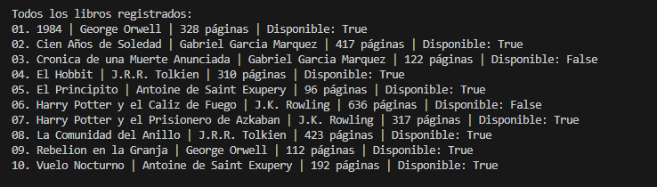

---

## 1.2 Recuperar libros cuyo autor sea "Gabriel Garcia Marquez"

### Código:

```python
Libro.objects.filter(autor__nombre="Gabriel Garcia Marquez")
```
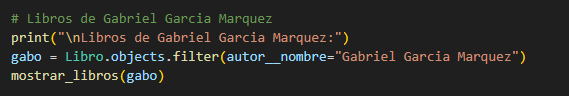
### Explicación:

Filtra los libros utilizando la relación ForeignKey hacia Autor.

### Evidencia:

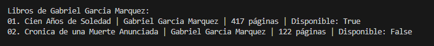

---

## 1.3 Recuperar libros con más de 200 páginas

### Código:

```python
Libro.objects.filter(paginas__gt=200)
```

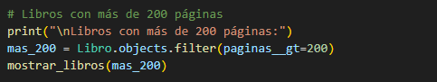

### Explicación:

Usa un filtro comparativo (__gt) para obtener libros mayores a 200 páginas.

### Evidencia:

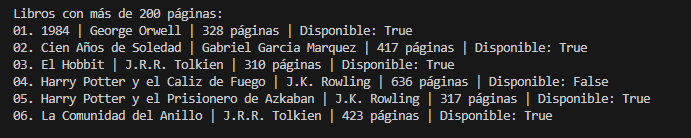

---

# 2. Filtros y exclusiones

## 2.1 Mostrar solo libros disponibles

### Código:

```python
Libro.objects.filter(disponible=True)
```

### Explicación:

Filtra libros cuyo campo booleano disponible sea True.

### Evidencia:

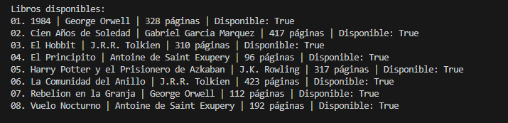

---

## 2.2 Excluir libros con menos de 100 páginas

### Código:

```python
Libro.objects.exclude(paginas__lt=100)
```
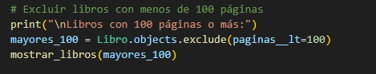
### Explicación:

Excluye todos los libros cuya cantidad de páginas sea menor a 100.

### Evidencia:

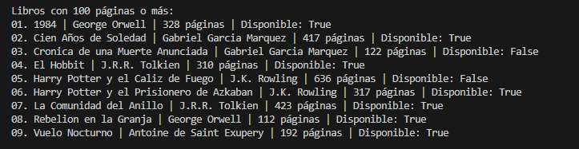

---

# 3. Consultas SQL personalizadas

## 3.1 Consulta SQL con raw() ordenada por título

### Código:

```python
Libro.objects.raw("SELECT * FROM biblioteca_libro ORDER BY titulo ASC")
```
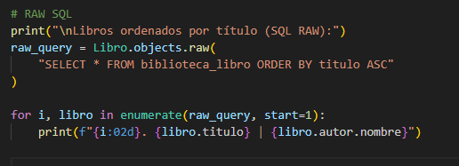
### Explicación:

Ejecuta una consulta SQL directa utilizando el método raw().

### Evidencia:

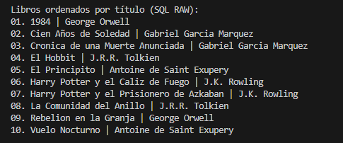

---

## 3.2 Consulta SQL usando connection.cursor()

### Código:

```python

    with connection.cursor() as cursor:
    cursor.execute("""
        SELECT a.nombre, COUNT(l.id)
        FROM biblioteca_libro l
        JOIN biblioteca_autor a ON l.autor_id = a.id
        GROUP BY a.nombre
        ORDER BY COUNT(l.id) DESC
    """)
    resultados = cursor.fetchall()
```
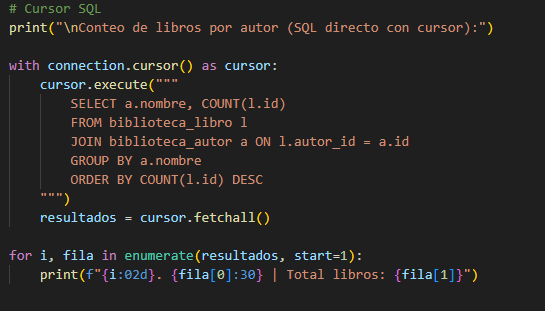
### Explicación:

Ejecuta una consulta SQL manual utilizando JOIN y GROUP BY para contar libros por autor.

### Evidencia:

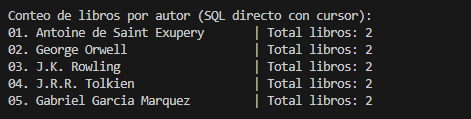

---

# 4. Campos específicos y anotaciones

## 4.1 Recuperar solo los títulos

### Código:

```python
Libro.objects.values("titulo")
```
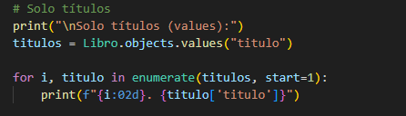
### Explicación:

Obtiene únicamente el campo titulo usando values().

### Evidencia:

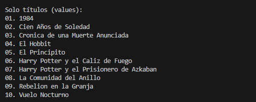

---

## 4.2 Conteo de libros por autor usando annotate()

### Código:

```python
Libro.objects.values("autor__nombre").annotate(total=Count("id"))
```
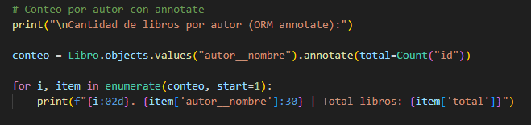
### Explicación:

Agrupa los libros por autor y calcula el total utilizando annotate().

### Evidencia:

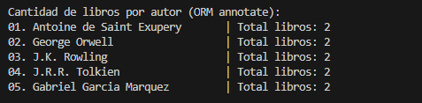

---


